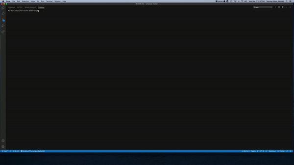

# EMPLOYEE TRACKER ("employee-tracker")

REPO: https://github.com/smoyamendez/team-profile-generator

## Table of Contents
  ---
* [Description](#description)
* [Installation](#installation)
* [Usage](#usage)
* [Contributing](#contributing)
* [Questions](#questions)

## Description
---
A CMS system for tracking employees roles and departments using node, inquirer, and MYSQL.

## Installation 
---
Make sure you have node js installed. Here is the link if needed: https://nodejs.org/en/download/ You can then fork this repo so you have a copy of your own to generate your team. After you have forked this repo and have a copy of it locally, in your terminal, change directories into the location you saved it in. Run npm install to install the package. Once that is downloaded, make sure you are in the root of the folder where the index.js file is. Then run the command 'npm start' to start the prompts.

## Usage
---
Here is a video walk through of the user experience:

## Contributing
---
Author: Sommer Moya-Mendez

## Questions
---

[GitHub](https://github.com/smoyamendez)

If you have any questions, please email me at: smoyamendez@gmail.com